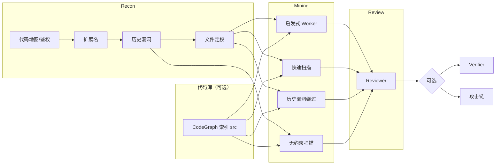

# VulnHunter-White 设计文档

## 1. 前言

LLM 白盒审计已经从「把仓库丢进对话框」走到「多角色流水线 + 工具 + 验证」。在实现 VulnHunter-White（以下简称本项目）的过程中，我们逐步沉淀了一套可落地的 Agent 编排、覆盖率约束与多层验证方案。

本文目标：

1. 简要介绍本项目的功能与界面能力
2. 总结白盒 Agent 设计中的共性要点与常见坑点，并给出本项目的应对方式
3. 详细介绍本项目的设计思路、创新点，以及设计动机

项目仓库：<https://github.com/1diot9/VulnHunter-White>

---

## 2. 功能简介

VulnHunter-White 的特点：

- 支持**赏金 / 全量 / 自定义**三种挖掘模式
- 支持**Web 应用 / 组件库 / 混合**三种审计对象（`target_kind`，与挖掘模式正交）
- 支持**靶场动态**、**局部 harness**、**纯静态**三种审核验证方式
- 可选 **FOFA 互联网验证**与 **Human-in-the-loop** 确认
- 挖掘与审核结束后可选**攻击链串联**
- 设置页可配**模型商池**（多 Base URL、同轮同模型优先、会话粘滞、端点故障换路）
- 每项目可设 **Token 用量上限**与 Worker 人工提示；可从公开 GHSA **发现仓库**
- 漏洞产出含**产出日历**、中文报告 / Advisory / CVE JSON，可追问与打包下载

创建任务页面：通过 GitHub 链接或上传 zip 开始审计，支持设定最大 Token 用量。

任务详情页面：SSE 实时日志、阶段报告、运行中动态配置。允许实时注入用户指令，或对任意阶段新开。

互联网验证确认页面：对可能产生危害的漏洞进行人工干预。

漏洞产出页面：验证形式（静态 / 动态 / 局部）、权限（前台 / 后台）、互联网复现情况。报告支持普通格式、advisory 格式、CVE JSON。可追问报告、复制 CVE JSON、下载报告与 PoC 压缩包。产出日历按日统计已确认与误报。

容器管理页面：监测动态复现时启动的容器。项目详情也可一键启停本项目 Docker 靶场并重映射端口。

设置页面：Chat Completions / OpenAI Responses / Anthropic Messages、自定义挖掘提示词、日志清理等，支持设置多个服务商作为 LLM 池（当前模型商主要测试过 GLM、DeepSeek、百炼）。

发现仓库页面：可按用户提示词搜索 GitHub 仓库，也可从公开 GHSA 筛可审计仓；会排除官方演示、示例工程和学习用项目。关键词粗分后再用模型复核审计对象；已创建与可创建分开列出，可单条或一键移除候选。搜索默认限时 600 秒，超过 5 个时每多 1 个加 60 秒；超时会说明原因并保留已找到的仓库。

---

## 3. 白盒 Agent 设计要点

本节概括白盒 Agent 的共性设计问题。具体在本项目中的落地方式见第 4 节。

### 3.1 角色拆分

白盒审计上下文长、子任务差异大，通常拆成多个角色：**编排器、侦察器、挖掘器、验证器**（以及修复、互联网验证、攻击链等专项角色）。各角色使用独立提示词与工具 ACL，避免单会话上下文膨胀。

### 3.2 工具要有边界

- **按角色启用工具集**：侦察阶段不应调用 `SubmitVuln`，审核阶段不应随意 `Write` 源码。
- **权限与 hook**：Shell 禁止破坏项目工作区；Read/Grep 限制在工作区内；危险操作需门闩或人工确认。

### 3.3 审计流程与覆盖率

常见做法是由扫描器结果或 Agent 自由选点。本项目采用**文件定权 + 按权重排队**：确保全量覆盖，并对不同角色文件使用不同挖掘策略（正向 source→sink、回推、控面、薄扫）。

### 3.4 项目状态由谁管

任务结束可以交给 Agent 自行 `finish`，也可以由**代码状态机 + 落盘文件**约束。对于需要全覆盖的场景，必须防范 LLM「偷懒提前收工」，因此关键进度（如定权文件是否全部 `FinishFile`）由代码判定。

### 3.5 把 LLM 当作不可靠组件

模型可能返回畸形工具调用、多轮重复同一调用、长时间纯文字无进展、各厂商 429/超时。需要：**看门狗提醒、死循环拦截、超时抢救（Conclude）、检查点续跑、上下文压缩、全局 LLM 线程池排队**。

### 3.6 产物要结构化

漏洞、历史洞、攻击链、阶段摘要等均通过**专用工具落盘**，便于代码判定阶段完成、去重合并、前端展示与人工审查。

---

## 4. VulnHunter-White 设计分析

以下按「创建 GitHub 项目 → 审计完成」的顺序说明设计考量。默认流程：**Recon → 挖掘（启发式 / 快速扫描 / 历史漏洞绕过 / 无约束扫描，至少一条）→ Reviewer → 可选 Verifier / 攻击链**。创建时可勾选代码库，开启后与 Recon 并列，都完成后才挖掘。

### 4.1 工具集

通用工具（定权、Sink 筛选等原子阶段有独立工具集，此处不列）：

| 工具 | 用途 |
| --- | --- |
| Read | 读取单个或多个文件内容 |
| Glob | 按模式列出文件 |
| Grep | 搜索代码片段、关键字、函数、危险调用 |
| Write | 写入审计过程中的产物或辅助材料 |
| Bash | 在允许时执行 shell 命令 |
| PowerShell | 在允许时执行 PowerShell 命令 |
| TodoWrite | 维护运行时待办；每 50 轮自动注入上下文，压缩后自动注入 |
| SearchOldVuln | 查已落盘历史洞或本项目已提交/已确认报告，用于去重与攻击链 |
| WebSearch | 互联网补搜（历史漏洞补漏阶段） |
| SearchGHSA | 查 GitHub Advisories |
| SearchGitHubIssues | 查本仓库未关闭 Issues |
| ReadCveRecord | 读取本条漏洞的 CVE 5.2 JSON 填表状态 |
| SetCveRecordField | 按字段写入 `cve.json`；未知填 `VULNHUNTER_PENDING`，不要整文件覆盖 |
| RunCode | 局部验证沙箱执行 harness（Python/PHP/JS/Ruby/Go/Java/Bash/C；仅 harness 审核轮注入） |
| SearchTools | 检索 `tools/cli` 已索引的用户 CLI（审核轮） |
| FinishIndex | CLI 静默索引轮写入口与描述后结束 |
| ListBytecode | 枚举 `src/` 下 `.class` / `.jar` / `.war`（不受普通 Glob 后缀忽略限制；默认仍跳过 `target` 等） |
| DecompileJava | 内置 jadx 反编译：索引命中立即返回，否则异步入队；详见 [java-decompile.md](./java-decompile.md) |

运行时 Bash 与 PowerShell **只注入本机原生的那一个**。`Read` / `Grep` / `Glob` / `SearchOldVuln` / `SearchTools` / `WebSearch` / `ListBytecode` / `DecompileJava` 允许同一助手回合并行（后两者为立刻返回的异步提交/查询，不阻塞本轮）。

### 4.2 编排策略与状态管理

**代码负责总编排**；阶段内流转多数由 Agent 调用工具触发，部分关键节点由代码硬约束：

| 机制 | 由谁决定 |
| --- | --- |
| 侦察鉴权文档是否完成 | 检测文档落盘 |
| 启发式单轮结束 | Agent 调用 `FinishRound` |
| 启发式全部结束 | 代码：所有定权文件已 `FinishFile`（或跳过） |
| 项目 completed | 代码：各开启挖掘路径结束 + 审核队列清空 + 可选 Verifier/攻击链闸门 |

这样既保留 Agent 灵活性，又对**全覆盖、不误报堆积**施加硬约束。

### 4.3 容错与恢复机制

#### 检查点与续跑

1. 检查点落在 `workspace/checkpoints/`，保存消息、看门狗和限流计数；暂停或进程中断后按原上下文续跑。改挖掘模式或验证方式会丢弃对应检查点，续跑后按新规则新开。GitHub 项目从暂停转为运行时，先比对上游 HEAD：有更新则浅拉取到最新 `src/`、刷新文件索引后再续跑；检查失败不阻塞。zip 项目不检查。
2. 超时、429 用尽或死循环退出前先 **Conclude 抢救**（默认 1800s），摘要落到 `docs/summaries/{phase}-rescue`，下一轮注入后续跑。普通阶段最多再开 2 次，侦察最多 8 次（对应四个小阶段）。Conclude 选取最近 100 轮消息，截断后注入 TodoList 再摘要，并额外写入完整 TodoList。
3. 请求超过上下文窗口 85% 时主动压缩，新开上下文并注入 Conclude；启发式再注入最近最多 10 轮 `worker-round-N.md` 摘要。Worker 认领超过约 7200s 视为过期，可被回收另派。

#### 超时与限流

4. 各阶段墙钟超时：侦察 3600s，盖章轮 1800s，Worker 一轮 7200s，审核静态 1800s，靶场动态再加 Docker 1800s，Verifier / 攻击链 / Semgrep / Sink 筛选各 1800s。审核超时后最多再跑一轮（强制仅静态），再超时标误报。Verifier 超时直接将该条标 fail，不再新开轮。其它阶段最多超时 2 次，此后抢救落盘并保留基本产出。
5. LLM 429 休眠 90s 再试，最多 20 次；其它瞬时失败最多退避 3 次。设置页模型商池：多个 Base URL（各自协议、Key、模型、并发上限；协议空则跟随全局接口协议），全局线程上限 = 未禁用端点并发之和（单端点默认 6）；新会话按利用率均匀分配，同一轮对话优先沿用相同模型以提高前缀缓存命中，同模型端点间仍均摊负载并尽量粘滞原端点，满则按到达顺序排队。设置页可勾选禁用某个端点（配置保留、不参与分配）。项目暂停后释放该名额，续跑时重新排队。同一端点两次发请求默认至少间隔 2 秒（设置页可改，0 关闭），后来的请求按到达顺序排队，排队时间不计入阶段超时与 HTTP 读超时。某端点 429 / 额度用尽 / 5xx 只冷却该端点并立刻换路，不拖垮全池；冷却结束后重新参与分配（漏洞报告追问同样走线程池并换路）。项目级 `llm_model` 仍优先。

#### 工具执行容错

6. 工具调用失败把 error 回给模型；本地执行失败另记 `tool-exec-errors.jsonl`。上一轮工具已调用但失败时，下一轮纯文字会提醒按错误改参，不要原样重试。
7. Shell 默认 120s、最多 180s，另有硬超时。出站 HTTP / Chat 代理连不上时自动改走直连。

#### 看门狗提醒

8. 无工具调用的纯文字轮立刻提醒改用工具；有一次真工具调用后连续无工具计数清零。门闩满足后系统自己结束本轮。
9. 连续 4 次同一工具且参数不变则拦截并重置窗口；同一轮死循环窗口触达 5 次则终止本轮。
10. 历史漏洞落盘 / 补漏连续 50 轮未 `WriteOldVuln`、扩展名连续 50 轮未 `AddSourceExt` 则催落盘；代码地图 / 鉴权轮不催。
11. 启发式连续 50 轮未 `FinishFile`、快速扫描未 `FinishSink`、绕过未 `FinishBypass`、Sink 筛选未 `FinishSinkTriage` 则催收工；`Read` / `Grep` 不计入空闲。无约束扫描不催收工。CLI 静默索引连续 8 轮未 `FinishIndex` 则催落盘描述。

#### 审核与验证闸门

12. 同一条待审漏洞超时后最多再跑一轮（该轮强制仅静态，隐藏 Shell、`RunCode`、`CollectLabFingerprints`）；再超时则标误报（徽章「误报-审核超时」），不再重试。打回上限为 1，超过直接标误报。
13. `SubmitVuln` / `ConfirmVuln` 碰到同文件同类型或同根因时先软提醒；本会话被提醒过一次后，再带 `confirm_not_duplicate` 才放行。
14. 局部验证沙箱不可用或 mock 失败不因此误报，静态已能证明则可 `static_only` 确认。Verifier 遇到破坏性复测会 `AskUser` 挂起，在「验证确认」页等待指示，不阻塞项目完成。

### 4.4 侦察阶段

#### 4.4.1 代码地图与鉴权（recon）

Java 字节码反编译：Recon 用 `ListBytecode` 发现、`MarkBusinessJar` 点名要纳入定权的业务 jar/class（系统可启发式自动入队预读）；挖掘与审核用 `DecompileJava` 补录，**允许整包 jar**，默认输入 ≤80MiB。任务挂项目级队列，不阻塞地图门闩。产物在 `workspace/decompiled/`。**仅 `MarkBusinessJar` 点名的包**在 jadx `ready` 后滴注入 `FileWeight`；`DecompileJava` 只供临时阅读。盖章可与反编译并行，已入库的反编译类混入未标记队列。点名列表仍有 queued/running 或 sidecar 仍有待入库路径时，不置 `recon_done`。jadx 默认 2 槽，预留 1 槽给 Worker/Reviewer 的 `DecompileJava`。完整决策见 [java-decompile.md](./java-decompile.md)。

| 工具 | 用途 |
| --- | --- |
| MarkSource | 标记用户可控入口，自动权重 100 |
| FinishReconMap | 仅地图重跑：写回代码地图与鉴权文档后结束会话 |

每项目可配置 `recon_hint`，注入侦察各小阶段（地图/鉴权、扩展名、历史漏洞、盖章）每轮用户消息。

至少需要两份落盘文档：

- **代码地图**：项目概述、技术栈、模块划分、HTTP 入口、非 HTTP 入口（WebSocket / RPC / MQ / 回调等）、关键依赖。
- **鉴权分析**：角色与资源、鉴权链路，决定后台洞能否升级为前台洞，并辅助越权挖掘。

#### 4.4.2 扩展名（recon_source_ext）

| 工具 | 用途 |
| --- | --- |
| AddSourceExt | 把默认未入库的执行面文件补进索引 |

根据代码地图补充需审计的扩展名。

#### 4.4.3 历史漏洞收集

**爬虫落盘（recon_old_vuln）** - 禁止 WebSearch，不读源码：

| 工具 | 用途 |
| --- | --- |
| WriteOldVuln | 逐条写入历史漏洞文档并更新索引 |
| SearchOldVuln | 查已落盘条目，避免重复写 |

**搜索补漏（recon_old_vuln_ghsa）**：

| 工具 | 用途 |
| --- | --- |
| WebSearch | 按本项目产品名补搜公开 CVE / 公告 |
| SearchGHSA | 公开公告不足时查 GitHub Advisories |
| SearchGitHubIssues | 本仓库未关闭 Issues，作为未修复洞来源 |
| WriteOldVuln / SearchOldVuln | 补漏命中立刻落盘 / 去重 |

已修复洞（`patched`）用于绕过尝试；未修复洞（`unpatched`，主要来自 Issues）用于挖掘去重。

#### 4.4.4 文件定权（recon_mark）

| 工具 | 用途 |
| --- | --- |
| MarkSource | 标记用户可控入口，自动权重 100 |
| MarkWeight | 给文件打 0–100 审计权重 |
| MarkSkip | 跳过测试 / 生成代码等文件 |

定权策略与挖掘方向：

| 角色 | 方向 |
| --- | --- |
| 权重 100 / has_source | 正向 source→sink（含非 HTTP） |
| 过滤器 / 鉴权 | 控面（匹配、绕过、失败开放） |
| Service | 危险操作与鉴权缺口，回推 caller / 二阶 |
| Util / Mapper / 模板 | 执行面或 sink 回推 |
| DTO / 常量 / 死代码 | 薄扫后收工 |

初始上下文为代码地图 / 鉴权文档；每批传入 150 个文件名，由 Agent 调用 Mark 系列工具定权。

Recon **不读**代码库产物。代码库与侦察并列，见 4.5 节开头的门闩。

### 4.5 挖掘阶段

挖掘须等 **Recon 完成**。若项目开启了代码库，还须等其首次构建结束（`ready` 或 `degraded` 都算完成）。代码库默认关闭，创建时勾选；开启后由地图 Agent `MarkCodeIntel` 点名 CodeGraph（`src/`）与/或 Jar Analyzer（业务 jar）再构建，供 Worker / Reviewer 的 `FindSymbol` / `FindCallers` / `FindCallees` / `TraceCalls` 查调用关系（Resolver 路由，不让 Agent 选库）。失败则降级继续用 Read/Grep。源码变化只标过期，由用户点重建，不自动重建。关闭会删除该项目索引以释放磁盘。jadx 仍只负责反编译。

#### 4.5.0 漏洞挖掘模式

- **赏金模式（默认）**：只挖掘高危漏洞，不报告反射 XSS、CORS 安全头等低危害项。无害/受限文件操作与不可获取且不可预测的对象键（他人分享链接/邮件/预览 URL 不算可获取）直接丢弃。
- **全量模式**：报告低危害漏洞。无害/受限文件操作与不可获取且不可预测的对象键仍应误报，不入库。
- **自定义模式**：在设置页用自然语言描述挖掘范围，项目选用时快照正文，无赏金硬闸门。基座提示仍要求丢弃无害文件操作与不可独立获取的对象键，自定义条款可覆盖。

#### 4.5.0b 审计对象（target_kind）

与挖掘模式正交，创建时选定（暂停/完成可改）：

- **Web 应用（默认）**：HTTP / 非 HTTP 入口为 source，行为与历史版本一致。
- **组件库**：公开 API / 解析器 / SPI 为调用方可控入口；验证默认偏 harness；通常关闭 FOFA Verifier。
- **混合**：优先挖库核心；demo/sample/examples 降权。提示词包见 `prompts/target_kinds/`。

#### 4.5.1 启发式挖掘（worker）

| 工具 | 用途 |
| --- | --- |
| SearchOldVuln | 与历史洞 / 已提交报告去重 |
| SubmitVuln | 提交待审核漏洞（同时交中文报告与英文 Advisory） |
| ReadCveRecord / SetCveRecordField | 提交后逐字段填写 CVE JSON 英文详述 |
| AppendAffectedLocations | 向已有待审报告追加同根因受影响点 |
| FinishFile | 标记文件不必再作为后续轮次焦点 |
| FinishRound | 焦点文件分析完后结束本轮 |
| FinishFix | 打回轮纠正入口 / sink / 根因后重新入队 |

**创新点：按定权文件排队，而非 Agent 自由选点。** 权重从高到低，每文件一轮；每轮产出 `worker-round-N.md` 摘要，后续轮注入最近 10 轮摘要，避免重复尝试。

**轻量开关**：只把权重 100 的文件当入口，降低 token 消耗。每项目可配置 `worker_hint`，注入启发式 / 快速扫描 / 历史漏洞绕过 / 无约束扫描每轮用户消息。

**AppendAffectedLocations**：同根因多受影响点合并为父子报告集合，避免重复报告又不丢信息。

#### 4.5.2 历史漏洞绕过（bypass_worker）

| 工具 | 用途 |
| --- | --- |
| SearchOldVuln | 与历史洞 / 已提交报告去重 |
| SubmitVuln | 绕过补丁或确认未修复洞仍可打时提交 |
| ReadCveRecord / SetCveRecordField | 提交后填写 CVE JSON |
| AppendAffectedLocations | 追加同根因受影响点 |
| FinishBypass | 结束本轮注入的这一条历史漏洞 |

数据源为侦察阶段 `docs/old-vulns/`；每轮注入一条历史漏洞文档，产出绕过摘要。对应手挖时「先复现历史洞再尝试绕过补丁」的工作习惯。

#### 4.5.3 快速扫描

**Sink 筛选（sink_triage）**：

| 工具 | 用途 |
| --- | --- |
| FinishSinkTriage | 提交本批 Sink 的 keep / drop / defer |

**快速扫描 Worker（fast_worker）**：

| 工具 | 用途 |
| --- | --- |
| SearchOldVuln | 与历史洞 / 已提交报告去重 |
| SubmitVuln | 按本轮 Sink 回推后提交 |
| ReadCveRecord / SetCveRecordField | 提交后填写 CVE JSON |
| AppendAffectedLocations | 追加同根因受影响点 |
| FinishSink | 结束本轮注入的 Sink |

三步流水线：**Semgrep（纯代码，最多 200 条）→ Agent 精筛（最多 60 条）→ 按 Sink 回推 source**。快速路径覆盖 SAST Sink；鉴权 / IDOR / 业务逻辑仍靠启发式。

#### 4.5.4 无约束扫描（unconstrained_worker）

| 工具 | 用途 |
| --- | --- |
| SearchOldVuln | 与历史洞 / 已提交报告去重 |
| SubmitVuln | 提交待审核漏洞（始终走赏金闸门） |
| ReadCveRecord / SetCveRecordField | 提交后填写 CVE JSON |
| AppendAffectedLocations | 追加同根因受影响点 |
| FinishRound | 本轮上下文压缩满 2 次后才注入；结束本轮 |

与启发式隔离：只注入 `docs/code-map.md` 与 `docs/auth.md`，不派发定权焦点。固定并发 1。历史漏洞收集完毕后启动。Submit/Confirm 始终走赏金闸门。路径结束由 Reviewer 对前台产出标 `rce_effect=true` 决定，不看 `vuln_type` 是否为 rce；当前轮仍跑完。用户可在无约束日志输入框停止或再启动；停止会打断当前轮，若其他阶段已结束则项目完成。无 `FinishFile`。

#### 4.5.5 报告修复（fix）

Reviewer 仅在入口 / sink / 根因分析错误时 `ReturnToWorker`；PoC 与报告包装由 Reviewer 收口，一般不打回 Worker 改 PoC。Fix Worker 用于纠正分析债务，工具含 `SearchOldVuln`、`SubmitVuln`、`ReadCveRecord` / `SetCveRecordField`、`AppendAffectedLocations`、`FinishFix`。

### 4.6 审核阶段

创建项目时三选一：**纯静态（默认）**、**靶场动态**、**局部验证（harness）**。

#### 4.6.1 靶场搭建（reviewer_lab）

| 工具 | 用途 |
| --- | --- |
| FinishLab | 结束独立 Docker 靶场搭建轮 |

开启靶场动态验证时，项目开始即搭建 Docker 环境；镜像 `{项目名}-{id}:lab`，Web 容器 `{项目名}-{id}`。**被测应用必须使用导入的 `src/` 当前代码**，禁止换成旧发行版镜像。

#### 4.6.2 靶场验证（reviewer）

| 工具 | 用途 |
| --- | --- |
| ConfirmVuln | 确认漏洞：Agent 填 CVSS 3.1 与 4.0 向量，系统计分，并标注价值分层 |
| MarkFalsePositive | 判定误报 |
| ReturnToWorker | 仅入口 / sink / 根因分析错误时打回 |
| MergeIntoVuln | 同根因同危害重复报告并入主报告 |
| CollectLabFingerprints | 从靶场升级项目共享指纹 |
| SearchTools | 搜索已索引的用户 CLI |
| SearchGHSA / SearchOldVuln | 查公告与已提交报告 |
| ReadCveRecord / SetCveRecordField | 收口 CVE JSON（`descriptions` 须含入口→sink、漏洞代码路径与原文、HTTP/API PoC） |
| RunCode | 仅局部验证轮：在沙箱跑 harness（含 C / gcc；无 rustc） |

要点：

- 靶场可用时 **ConfirmVuln 会系统再执行落盘 `poc.py`**（`python poc.py -u <target_url>`，默认英语输出），退出码非 0 则拒绝确认。`poc.py` / `harness.py` 的标签、状态、告警、判定须中英双语：默认英语，`--zh` 切中文。
- PoC 由 Reviewer 收口；缺失或跑不通且需改写时才用 **Java / Node / Python debug MCP**。
- `SearchTools` 检索 `tools/cli` 下用户放置的 CLI（如 JNDI、恶意 JDBC 服务），按绝对路径 Shell 执行。后台静默索引轮（`cli_indexer`）用 `FinishIndex` 写入入口与描述；内容变了才重索引。
- 需要看无源码的 class/jar 时用 `DecompileJava`（禁止 Shell 直调 jadx/cfr）；强制仅静态轮仍可用。路径约定见 [java-decompile.md](./java-decompile.md)。

#### 4.6.3 局部验证（harness）

项目级仍为 `dynamic_verify_mode=harness`，**按漏洞**选择验证深度（`harness_depth`）：

| 深度 | 方式 | 证据 |
| --- | --- | --- |
| **sink**（默认） | `vulnhunter/sandbox:latest` 中 RunCode：抽出函数 + mock | `harness` |
| **module** | 同沙箱内 import 项目 `src/` 模块，按真实调用序打 payload | `harness` |
| **integration**（L3） | `vulnhunter/integration-sandbox:latest`：容器内临时装依赖 → 起 `127.0.0.1:$PORT` 服务 → 跑 `poc.py` | **`dynamic`** |

L1/L2 规则不变：公开入口吃 HTTP/请求对象时用 **httptest 同进程**（仍为 harness）；YAML/编解码等无请求面 API 不要包 HTTP。`RunCode` 语言为 Python / PHP / JS / Ruby / Go / Java / Bash / **C（gcc + glibc）**；镜像无 rustc / g++，Rust / C++ 标 `unsupported_language` 后仅静态确认，不要反复探测编译器。C harness 不要依赖 OpenSSL 等第三方库。

L3 通过 `ConfirmVuln(harness_depth=integration, integration_start=...)` 触发；须报告已有「### 局部验证」章节。integration 沙箱与 harness 沙箱不同（bridge 网络、可写、含 npm）。沙箱不可用时可用 `env/env.json` 的 `local_service_url`（仅 loopback）走本机 fallback。

`harness.py` 与 `poc.py` 职责分离。L3 成功后 `evidence_level=dynamic`。仅 harness 确认的前台洞仍入队 Verifier：无可用 HTTP PoC 时按报告构造 payload。已 harness 确认且有 `poc.py` 的漏洞可在 harness 项目下「追加集成验证」，无需切靶场模式。

#### 4.6.4 静态验证

Reviewer 复核数据流是否用户可控、防护是否有效、权限标注是否正确；`evidence_level=static_only`。

### 4.7 互联网验证（verifier）

| 工具 | 用途 |
| --- | --- |
| FofaSearch | 只读 FOFA 测绘同款前台目标 |
| AskUser | 破坏性复测前询问用户 |
| FinishVerifier | 提交结论并结束本轮 |

对已确认**前台**漏洞：按项目级指纹（`docs/app-fingerprints.json`）FOFA 搜索，默认每批 10 个、成功 3 个即结束，最多 5 轮（合计最多 50 目标）。命中目标项目内共享；0 条可改写语法最多 3 次。复测先读报告与 PoC 理解利用本质（入口 / sink / payload 机理 / 成功证据），优先跑原 `poc.py`；没有可换目标的 HTTP PoC（含仅 harness 确认）时按报告构造 payload，不自动跳过；原脚本在该目标失效时按同一条洞调整利用方式（路径前缀、编码、header 等），不覆盖已确认脚本、不换洞。破坏性操作 `AskUser`，在「验证确认」页 Human-in-the-loop，**不阻塞项目完成**。

### 4.8 攻击链串联（attack_chain）

| 工具 | 用途 |
| --- | --- |
| SearchOldVuln | 仅搜索本项目已确认产出 |
| Write / Bash / PowerShell | 有 Docker 靶场时起草与调试串联脚本 |
| SubmitAttackChain | 提交详文攻击链（最多 3 条；有靶场且无交互须 `chain_script`） |
| IndexAttackChain | 其余真链写入索引简述 |
| FinishAttackChain | 结束阶段（有链或无链都必须调用） |

挖掘与审核结束后，根据已确认漏洞尝试多步串联；优先危害最大、利用最简单的链写详文，其余一句话索引。有本地 Docker 靶场时，对纯 HTTP/脚本可打通的详文链编写串联脚本并由系统对靶场复测；含 XSS / CSRF 等需用户交互的链跳过动态验证。

### 4.8.1 产出漏洞去重（vuln_dedup）

| 工具 | 用途 |
| --- | --- |
| SearchOldVuln | 只搜侦察历史漏洞（`kind=old`，新收录优先） |
| Read / Grep / Glob | 读产出报告，并核对当前 `src/` 入口 / sink / 漏洞代码是否还在 |
| RecordVulnDedup | 记录公开结论与源码结论；已公开或最新代码已修默认标误报 |
| FinishVulnDedup | 结束本轮并写入 `docs/vuln-dedup.md` |

用户在项目详情「本项目漏洞」勾选产出后点 **产出漏洞去重**，系统开一轮独立 Agent：逐条与历史漏洞（尤其最新收录）对比是否已经公开，并对照当前 `src/` 判断漏洞是否还在。GitHub 项目在暂停或完成时会先同步上游 HEAD；审计进行中则用当前快照，以免打断挖掘。没有历史漏洞文档时仍核对源码。已公开标「误报-已公开」，最新代码已修标「误报-已修复」（已公开且已修也归「已修复」）。日志在阶段日志的「产出去重」Tab；不阻塞挖掘/审核，也不是项目完成闸门。

### 4.9 产品能力与运维

| 能力 | 说明 |
| --- | --- |
| 模型商池 | 见 4.3；设置页多 Base URL，同一轮对话优先同模型、会话粘滞、端点故障换路 |
| 项目 Token 上限 | `max_token_usage`（默认 0 不限制）按本项目全部 Agent 输入+输出合计，到达后自动暂停；提高上限或改为 0 后再续跑 |
| 接续对话 | 阶段日志 SSE 下方按当前小阶段：**引导**（进行中下一轮注入）、**接续**（用最新一轮完整消息继续）、**新开**（放弃检查点再跑一轮）。无约束扫描改为 **停止 / 启动**（无新开）；停止后若其他阶段已结束则项目完成。轮结束后检查点归档到 `workspace/last-conversation/` |
| 重置启发式进度 | 暂停或终态可用；清 `audited`/认领/启发式轮次摘要与 Worker 检查点。快速扫描 Sink 队列与绕过进度不重置；漏洞产出与侦察文档保留 |
| GitHub 发现仓库 | 可填用户提示词，由模型优先按意图构造 GitHub 搜索并筛选候选；留空则从公开 GHSA 筛星标与活跃度达标的仓库。排除官方演示、示例工程和学习用项目。关键词粗分后再用模型单轮复核 `target_kind`。已创建与可创建分开列出，可单条或一键移除候选使其不再出现。搜索默认 600 秒，超过 5 个时每多 1 个加 60 秒；超时返回原因并保留已入库候选 |
| 产出日历 | 漏洞产出页按日统计已确认与误报 |
| 报告产物 | 中文 `report.md`（标题须中文）、英文 `advisory.md`、CVE 5.2 `cve.json`。详情可追问改写、一键复制 CVE JSON、下载与批量下载相同的报告+PoC 压缩包 |
| 访问令牌 | `VULNHUNTER_ACCESS_TOKEN` 或设置页配置后，前端须先输入令牌才能调 API |
| 局域网监听 | 默认绑 `127.0.0.1`；`start.cmd --lan` / `sh start.sh --lan` 或 `VULNHUNTER_HOST=0.0.0.0` 对局域网开放 |
| Docker 发行版 | Windows Docker Desktop 或 Linux Engine：`docker/desktop/start.cmd` / `start.sh`。不自动搭建被测应用镜像；验证为关闭 / 局部验证 / 人工靶场。本机 `127.0.0.1` 改写为 `host.docker.internal`。本机根目录启停仍支持完整靶场动态 |
| 一键靶场 | 项目详情可启停本项目 Docker 靶场并重映射端口 |

### 4.10 流水线总览

---

## 5. 挖掘成果

目前大部分漏洞编号还在申请中。已在多个 Java / Python 项目（低代码平台、AI 网关、网盘、博客等）上试跑：

- 漏洞类型以 XSS、SSRF、越权为主；高危相对较少，最高危为前台 SQL、后台提权等。
- 赏金模式下每个项目约 3–40 条产出，误报与低质量报告较少。
- Token 消耗约 1 亿–10 亿；启发式轻量模式约 1 亿–3 亿。

已被 GitHub Advisory 接受的有两条：

漏洞产出页的产出日历：

后续申请完毕后会再列成果表格。

---

## 6. 不足之处

1. **暂不支持 Docker 一键部署**：动态靶场依赖宿主机 Docker，容器内无法再启 Docker；目前以本地应用方式运行，或部署时关闭动态验证。
2. **模型商覆盖有限**：主要测试官方 GLM、DeepSeek、百炼；中转站模型未系统验证。
3. **历史漏洞覆盖率无硬保证**：偏 GitHub / GHSA / WebSearch，依赖公开情报质量。

---

## 7. 漏洞评级附录

按 CVSS 3.1 基础分：9.0–10.0 为严重，7.0–8.9 为高危，4.0–6.9 为中危，0.1–3.9 为低危。Agent 填写 `cvss_vector`（3.1）与 `cvss4_vector`（4.0），分数由系统按 FIRST 公式计算；向量格式错误、或 PR 与 `attack_surface` / `required_account` 不一致时 ConfirmVuln / SetCveRecordField 返回具体错误。严重度与列表徽章以 3.1 为准；Advisory 与 CVE JSON 同时写入 4.0。

向量格式：

- `CVSS:3.1/AV:N/AC:L/PR:N/UI:N/S:U/C:H/I:H/A:H`
- `CVSS:4.0/AV:N/AC:L/AT:N/PR:N/UI:N/VC:H/VI:H/VA:H/SC:N/SI:N/SA:N`

| 度量 | 取值 |
| --- | --- |
| AV Attack Vector | N Network / A Adjacent / L Local / P Physical |
| AC Attack Complexity | L Low / H High |
| PR Privileges Required | N None / L Low / H High |
| UI User Interaction | N None / R Required |
| S Scope | U Unchanged / C Changed |
| C / I / A | H High / L Low / N None |

CVSS 4.0 另需：AT（N None / P Present）、UI（N None / P Passive / A Active）、VC/VI/VA（脆弱系统）、SC/SI/SA（后续系统，无跨边界时全 N）。XSS 默认 4.0 为 `UI:P/VC:L/VI:L/VA:N/SC:N/SI:N/SA:N`。

PR 必须与攻击面一致：前台 → PR:N，后台普通权限 → PR:L，后台管理员 → PR:H。须管理员先把攻击者控制的设备 / 邮箱 / Webhook / SNMP / unix-agent 源加进系统再注入的，标后台管理员（PR:H），不要标普通权限，也不要用「设备侧不用登录」或「普通用户打开页面中招」写成前台 / PR:N。XSS 默认 3.1 `UI:R/S:C/C:L/I:L/A:N`，不要因 Cookie/账户接管把 C/I 标 H。完整度量标准见 `backend/app/prompts/cvss.md`（注入 Reviewer 系统提示词与 ConfirmVuln 工具描述）。

---

## 8. 总结

白盒 Agent 中的容错与恢复机制（工具调用提醒、超时抢救、检查点续跑、结构化产物）同样适用于通用 Agent 系统。欢迎测试、提 Issue / PR 或在此基础上二开；若挖到高质量漏洞，也欢迎反馈以便补充成果列表。

---

## 9. 相关链接

- 项目仓库：<https://github.com/1diot9/VulnHunter-White>
- Java debug MCP：<https://github.com/1diot9/Java-debug-mcp>
- Node debug MCP：<https://github.com/1diot9/Node-debug-mcp>
- Python debug MCP：<https://github.com/1diot9/Python-debug-mcp>
